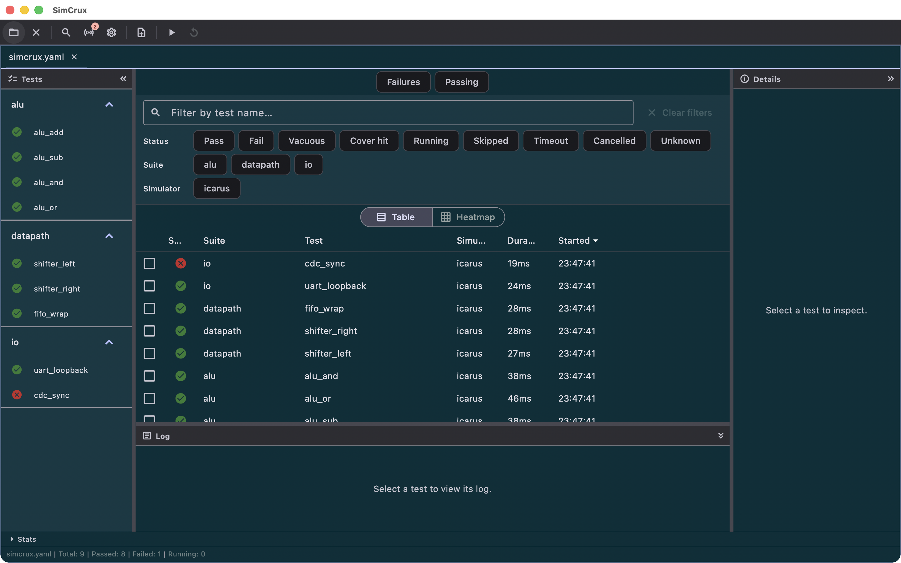

# simcrux

[](LICENSE)

SimCrux is a regression manager and results dashboard for open-source HDL simulators: it
takes a declarative `simcrux.yaml`, runs your testbenches under Icarus Verilog, Verilator,
GHDL or cocotb, classifies pass/fail, and gives you one dashboard over the results. Open
core, part of Ferrite Engineering's EDACrux suite.



<sub>SimCrux showing a nine-test regression across three suites — eight passing, one real failure.</sub>

## Status

Public beta. Implemented in this repository today:

- Six simulator drivers — Icarus Verilog, Verilator, GHDL, cocotb, and the RISC-V
  `riscv_arch` and `riscv_formal` drivers — each with compile/execute staging,
  process-tree reaping and timeout escalation.
- A YAML config loader with `includes:`, `.f` filelist expansion, parameter and seed
  sweeps, mixed-language validation, and three-level (defaults → suite → test)
  inheritance.
- Eight pass/fail detector types: `exit_code`, `string_match`, `regex`, `uvm_report`,
  `cocotb`, `golden_compare`, `composite` and `use`.
- A local job scheduler with bounded concurrency, named resource locks, waveform capture
  policy and dump retention.
- A results dashboard, inspector, NDJSON/summary persistence, and a CI runner with
  `--ci`, `--export`, `--fail-threshold` and `--fail-on-vacuous`.
- FuseSoC `.core` import, an exportable read-only static web dashboard, and CXP
  cross-probe ("Debug in WaveCrux").
- Update checks, the beta issue reporter, and en/zh_CN/zh/ja/ko localization.

## Pattern reference

`simcrux` follows the same open-core + Pro/Enterprise overlay pattern as WaveCrux:

- This repository is the open-core viewer/tool.
- The closed-source Pro overlay consumes this repo as a Git submodule and depends on it through a pubspec `path: ./simcrux` entry, layering Pro/Enterprise features via a `proOverrides` list spread into the open-core `ProviderScope`.

When in doubt about a convention, file layout, naming choice, or architectural seam, consult the WaveCrux reference implementation. Match its pattern unless this project has a documented reason to diverge.

## Prerequisites

SimCrux does **not** ship any simulator. Install the ones you want to drive and make sure
they are on your `PATH`:

| Simulator | Executables SimCrux looks for |
|-----------|-------------------------------|
| Icarus Verilog | `iverilog`, `vvp` |
| Verilator | `verilator`, `make` |
| GHDL | `ghdl` |
| cocotb | `make` (plus `cocotb-config` for the version probe) |

The `bundled` value of `simulators.<id>.source` in `simcrux.yaml` is a forward-looking
seam: it behaves exactly like `system` today — both resolve the bare executable name
against `PATH`. Use `source: custom` with `path:` for an explicit location. See
[`NOTICES`](NOTICES) §1.1.

## Build & run

```bash
git submodule update --init --recursive   # crux-shared
flutter pub get
flutter run -d macos      # or -d linux, -d windows
flutter analyze
flutter test
```

## Try it — no toolchain required

[`examples/`](examples/README.md) holds ready-to-open projects. Launch
SimCrux, use **File → Open Config…** (`Cmd/Ctrl+O`), pick one, then
**Tools → Run Regression** (`F5`):

- [`examples/riscv-compatibility-demo/`](examples/riscv-compatibility-demo/simcrux.yaml)
  — the RISC-V architectural-compatibility flow (`riscv_arch` +
  `golden_compare`) against a committed signature corpus. 8 tests, 3 pass /
  5 fail, over four extension suites.
- [`examples/riscv-formal-demo/`](examples/riscv-formal-demo/simcrux.yaml) —
  bounded proofs (`riscv_formal`) replaying committed SymbiYosys output. 7
  tests, 2 pass / 5 fail, one per verdict.

Both run in `mode: demo`, which is declared in the config and never in the
environment. **Neither needs a RISC-V cross-compiler, a reference model,
SymbiYosys, or a network connection** — demo mode skips only the spawn
steps and runs the identical driver code path.

## Platform support

| Platform | State | Notes |
|---|---|---|
| Linux | Supported | Primary target. |
| macOS | Supported | macOS 12.0 or later. |
| Windows | Supported | |
| Web | Supported | Read-only dashboard viewer — simulators are native binaries and do not run in a browser. |

No mobile build: the simulators are native binaries invoked as subprocesses, which a
phone cannot host.

## Contributing

Read [`CONTRIBUTING.md`](CONTRIBUTING.md) first — contributions require a signed
Contributor License Agreement ([`CLA.md`](CLA.md)).
[`docs/ARCHITECTURE.md`](docs/ARCHITECTURE.md) is the engineering reference: tech
stack, architectural rules, and the extension-point seams the Pro overlay plugs
into. User documentation lives at [docs.simcrux.app](https://docs.simcrux.app/), and
its source is in [`docs-site/docs/`](docs-site/docs/).

The quality gates, all of which must pass:

```bash
flutter analyze --fatal-infos --fatal-warnings   # zero-warning policy
flutter test
```

## License

SimCrux open core is licensed under the Apache License 2.0. See
[`LICENSE`](LICENSE) for the full text and [`NOTICES`](NOTICES) for
third-party attributions. Contributions require a signed
Contributor License Agreement — see
[`CONTRIBUTING.md`](CONTRIBUTING.md).

Apache-2.0 §6 grants no trademark rights, so the name and logo are
covered separately — see [`TRADEMARK.md`](TRADEMARK.md). Forks are
welcome; they just need a different name.

The simulators SimCrux drives (Icarus Verilog, Verilator, GHDL, cocotb) are
**separate programs**, invoked as subprocesses and never linked into the
SimCrux binary. Their own licenses — including the GPL of Icarus Verilog and
GHDL — apply to those programs, not to SimCrux. See [`NOTICES`](NOTICES) §1.
