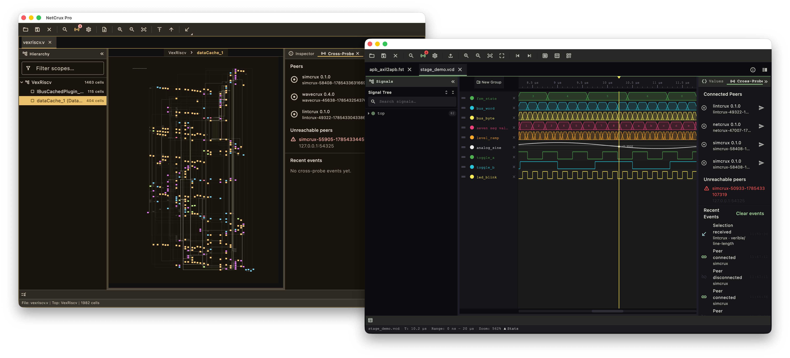

# Cross-probe & the suite

SimCrux is one tool in the EDACrux suite. The cross-probe (CXP) link connects it
to the other tools so a failing test flows straight into the waveform viewer,
and Pro multi-project workspaces let one
window span several projects. This page covers CXP, editor integration, and
workspaces.

## Cross-probe (CXP) {#cxp}

CXP — the Cross-Tool eXchange Protocol — is the suite's localhost link between
WaveCrux, NetCrux, LintCrux and SimCrux. Its specification is public at
[edacrux.app/cxp](https://edacrux.app/cxp). Receiving cross-probes and
**Debug in WaveCrux** are open core.

*Two suite apps discovering each other over CXP — each Cross-Probe panel lists
the connected peers, and inbound selections appear in the activity feed.*

| | |
| --- | --- |
| Transport | TCP, newline-delimited JSON, bound to `127.0.0.1` |
| Default port | `54325` (WaveCrux `54322`, NetCrux `54323`, LintCrux `54324`) |
| Advertised capability | `simcrux.debug` |
| Discovery | A shared per-peer manifest directory |
| Default state | **Enabled** |
| Scope | Localhost only |

Configure it in **Settings → CXP Cross-Probe**:

- **Enable CXP server** — on by default.
- **CXP port** — default `54325`; must be 1–65535.
- **Request attention on cross-probe** — on by default. Bounces the Dock icon
  (or flashes the taskbar) when a peer's request is acted on; never steals
  focus.
- **Broadcast selection automatically** — on by default. Announces each test or
  source selection to connected peers as you make it. When off, only explicit
  sends — **Debug in WaveCrux** and the panel's per-peer send — are shared.

Changing the enable switch or the port restarts the server. Disabling it removes
SimCrux's discovery manifest. The section's **CXP Status** row shows whether the
server is running and how many peers are connected.

### Discovery {#discovery}

No registry, no broadcast. Every EDACrux tool writes a JSON manifest into a
shared directory and watches that directory for peers.

| Platform | Manifest directory |
| --- | --- |
| macOS | `~/Library/Application Support/crux/cxp/peers` |
| Linux | `${XDG_DATA_HOME:-~/.local/share}/crux/cxp/peers` |
| Windows | `%APPDATA%\crux\cxp\peers` |

SimCrux's peer id is `simcrux-<pid>-<startedAtMillis>`, and its manifest is
`<peer id>.json`, rewritten every 30 seconds while it runs. The directory is
scanned every 2 seconds; a peer whose manifest has not been refreshed for 5
minutes drops out of view, and its file is deleted after a day. SimCrux dials the
manifests it finds; it never launches a peer. Start WaveCrux and SimCrux picks it
up within a couple of seconds.

## Connected peers {#peers}

The **Cross-Probe** panel docks as a tab beside **Details** on the right (drag
it to the bottom dock if you prefer). Open it with **View → Open Cross-Probe
Panel**, the **Cross-Probe Panel** toolbar button, or
++cmd+shift+x++ / ++ctrl+shift+x++. It shows:

- "Cross-probe server is offline." when the CXP server is not running.
- **Connected peers** — every other tool's manifest, with a send button per peer
  that sends the selected test as a highlight request. A refusal, or an
  acknowledgement that carries a reason, is shown as a notice.
- **Unreachable peers** — peers whose manifest exists but whose socket could not
  be opened.
- **Recent activity** — a rolling log of the last 50 events, inbound and
  outbound, with direction, kind, peer and a one-line summary. **Clear** empties
  it.

With Pro, right-clicking a results row adds
**Cross-probe to peer…** with a **Send selection to WaveCrux / NetCrux /
LintCrux** entry for each connected peer.

## Debug in WaveCrux deep-link {#deep-link}

The Details panel's **Debug in WaveCrux** action is the headline CXP use: it
hands the selected test's captured waveform to WaveCrux, with a hint about which
signals matter, so you go from a red row to the waveform in one click. The full
waveform workflow is on [Waveforms & debug](waveforms-and-debug.md).

1. Run a regression and select a failing test in the dashboard.
2. In the Details panel, press **Debug in WaveCrux**.

SimCrux checks that the test has a waveform and that the file is still on disk,
then finds the WaveCrux peer — it must both advertise `product_name: wavecrux`
in its manifest **and** be connected — and sends two messages:

1. A `notify_selection` whose element is the waveform path, carrying
   `simcrux.suggested_signals` (and, when known, the shared-workspace
   `crux.design_id`) in `metadata`. When the test has no curated signal list,
   the suggestion defaults to `['<top>.*']`.
2. A `request_highlight` for that same waveform path, after which SimCrux waits
   up to 5 seconds for WaveCrux's acknowledgement.

You get one of these notices:

| Notice | Meaning |
| --- | --- |
| "Sent to WaveCrux (…)." | WaveCrux acknowledged the request and acted on all of it. |
| "WaveCrux opened the trace but could not land where it was asked to: …" | WaveCrux opened the waveform but could not do everything asked; its reason follows. |
| "WaveCrux could not act on the request: …" | WaveCrux refused; its reason follows when it gave one. |
| "Sent to WaveCrux, but it never confirmed it acted on the request." | No acknowledgement arrived within 5 seconds. |
| "WaveCrux is not connected. …" | No WaveCrux instance was discovered and connected. |
| "Cross-probe is disabled. …" | Turn **Enable CXP server** on in **Settings → CXP Cross-Probe**. |
| "This test did not capture a waveform. …" | The selected test has no dump — check the [capture policy](waveforms-and-debug.md#policy). |
| "This test's waveform is no longer on disk — …" | A dump was recorded but has since been cleaned up. Re-run the test to regenerate it. |

!!! tip "Make sure a waveform exists"
    SimCrux asks the simulator for a dump under the default
    `waveform: { capture: on_failure }` and under `always`; `on_demand` and
    `never` request none. Icarus and Verilator testbenches must also call
    `$dumpfile` / `$dumpvars` themselves. When a test has no dump, press
    **Re-run with waveform** first.

### How a waveform travels over CXP v1 {#cxp-waveform}

CXP v1 has no `request_open_waveform` message kind. SimCrux models the waveform
as an `ElementId` of kind `source` whose path ends in a waveform extension —
`.vcd`, `.fst`, `.ghw` or `.wavecrux`. The receiver disambiguates on the
extension. Worth knowing if you are writing a peer.

### What SimCrux sends {#cxp-sends}

| Kind | When | Payload |
| --- | --- | --- |
| `notify_selection` | Test selection changes | Element of kind `test`, path = the test id |
| `notify_selection` | An explicit source selection changes | Element of kind `source` |
| `notify_selection` | **Debug in WaveCrux** | Element of kind `source` = the waveform path, plus `metadata["simcrux.suggested_signals"]` |
| `request_highlight` | **Debug in WaveCrux** | Element of kind `source` = the waveform path |
| `request_highlight` | The panel's per-peer send | Element of kind `test` = the selected test id, plus `metadata["crux.design_id"]` |
| `request_highlight_ack`, `request_open_source_ack`, `request_open_artifact_ack` | Replying to inbound requests | `in_reply_to`, `honored`, optional `reason` |

The two selection broadcasts stop when **Broadcast selection automatically** is
off. Outbound messages follow the active tab: switching tabs re-subscribes so
peers hear about the tab you are looking at.

### What SimCrux receives {#cxp-receives}

SimCrux handles three inbound kinds: `request_highlight`, `request_open_source`
and `request_open_artifact`. Anything else is ignored without throwing.

`request_highlight` routes on the element kind:

| Element kind | Effect | Ack |
| --- | --- | --- |
| `test` | Verified against the active tab's loaded config, then selected in the dashboard | `honored: true`, or `false` with a reason when the id is unknown |
| `source` | Recorded as the explicit source selection | `honored: true` |
| `signal`, `net`, `port`, `instance`, `scope` | The leaf name is applied as the dashboard's test-name filter — so highlighting `top.cpu.alu` filters the dashboard to tests whose id contains `alu` | `honored: true` |
| `breakpoint` | Refused — "breakpoint editor not yet implemented in this build" | `honored: false` |
| `marker`, `rule` | Refused — SimCrux does not own those element kinds | `honored: false` |
| anything else | Refused, forward-compatibly | `honored: false` |

When a `request_highlight` cannot be honoured as above but carries
`metadata["crux.design_id"]`, SimCrux looks that design up in the shared
workspace and, if a `source` artifact is recorded for it, opens that file in the
editor and acks `honored: true`.

`request_open_source` shells out to the configured editor and acks `honored` on
success. `request_open_artifact` does the same for `source` artifacts, resolving
the file through the shared workspace; other artifact kinds are refused. Every
inbound request lands in the tab you are looking at.

### Troubleshooting {#troubleshooting}

| Symptom | Check |
| --- | --- |
| **Debug in WaveCrux** says "WaveCrux is not connected" | Is WaveCrux running? Is the CXP server enabled in both? Does the manifest directory for your platform (see [Discovery](#discovery)) contain a `wavecrux-*.json`? Is WaveCrux listed under **Unreachable peers**? |
| Says "did not capture a waveform" | The test has no dump. Check `waveform.capture` for that test and whether its testbench dumps, or press **Re-run with waveform**. |
| Says "no longer on disk" | The dump was pruned. Retained failure directories can be pinned with a `.simcrux-keep` marker file. |
| Peer appears then vanishes | A manifest drops out of view after 5 minutes without its 30-second refresh; a crashed peer's file is deleted after a day. |
| Inbound highlight refused | Read the reason on the ack. For `test` elements it usually means the id is not in the config loaded in the active tab. |
| Nothing works from the web dashboard | Cross-probe is desktop-only. A browser cannot open TCP sockets. |

## Editor integration {#editors}

The Details panel's **Open testbench source** opens a test's testbench in your
editor, and inbound `request_open_source` requests use the same command.
Configure it in **Settings → Editors**: pick **VS Code**, **Sublime Text**,
**Vim** or **Emacs**, or write a **Custom** **Editor command** with the
`{file}`, `{line}` and `{column}` placeholders.

| Preset | Command |
| --- | --- |
| VS Code | `code --goto {file}:{line}:{column}` |
| Sublime Text | `subl {file}:{line}` |
| Vim | `vim +{line} {file}` |
| Emacs | `emacsclient -n +{line}:{column} {file}` |

## Multi-project workspaces Pro {#workspaces}

Pro lets one window hold several projects at once and remembers them.
**File → Switch Project…** (++cmd+p++ / ++ctrl+p++) jumps between open and
recently closed projects, and **Search → Search Across Projects…**
(++cmd+shift+f++ / ++ctrl+shift+f++) searches test names, failure messages and
file paths across every open project — useful when a shared IP block is tested
from several repositories. **Pin Project Tab** keeps a project open through
**Close All Projects**, and **Reopen Recent Project** brings back the last one
you closed; the recents list keeps the last 10. Each project keeps its own
filters, sort, selection and trend history.

These actions rest on Pro's persistent project registry and carry a PRO badge in
open core, where choosing one says it requires SimCrux Pro. The plain **File → Close All Tabs** — close every open tab, no
pinning, no registry — is open core.

## Sessions & workspaces on disk {#sessions}

SimCrux saves the open tabs and pane layout automatically and restores them on
the next launch; `--no-restore` skips that once, and `--reset` clears it (see
[Command line & CI](cli.md#arguments)).

| File | Status today |
|---|---|
| `.simcrux-workspace` | A multi-tab workspace document. **Open Workspace…** on the start screen and `--workspace <path>` load one. SimCrux has no command to save a workspace to a file of your choosing. |
| `.simcrux-session` | A single tab's state. **Open Session…** accepts the file, but session restore is not implemented — SimCrux does not yet read filters, selection or layout from it, and has no command to create one. |

Local run history lives in the trend database described on
[Trends, flaky tests & seeds](trends-and-flaky.md#history).
Enterprise adds a shared team history on
a [PostgreSQL database you own and host](team-database.md), fed by
`simcrux-pro push-results` from CI. Reading it back in every engineer's app is
planned for 1.1.
